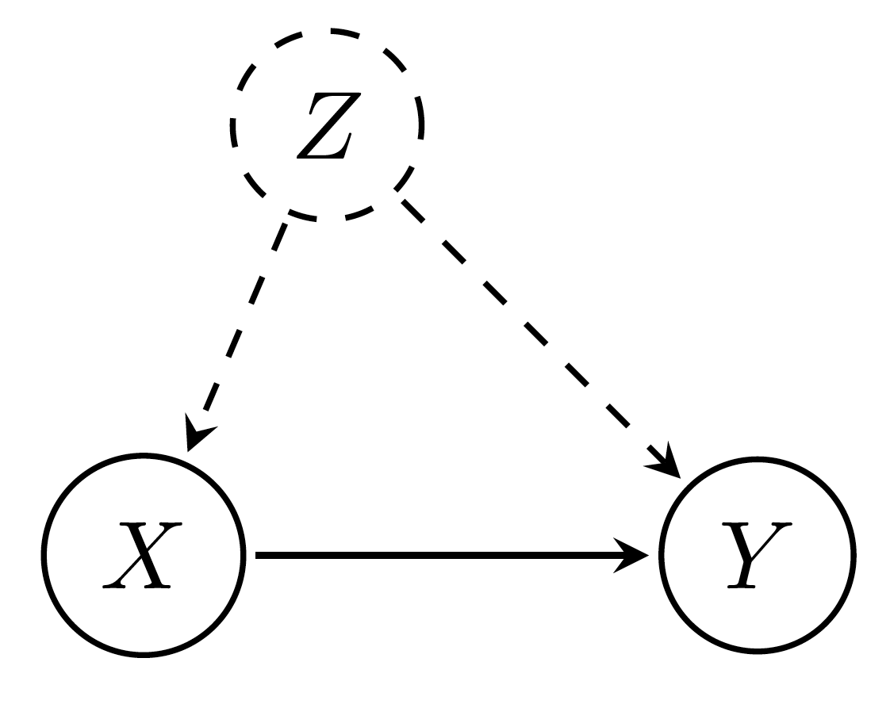
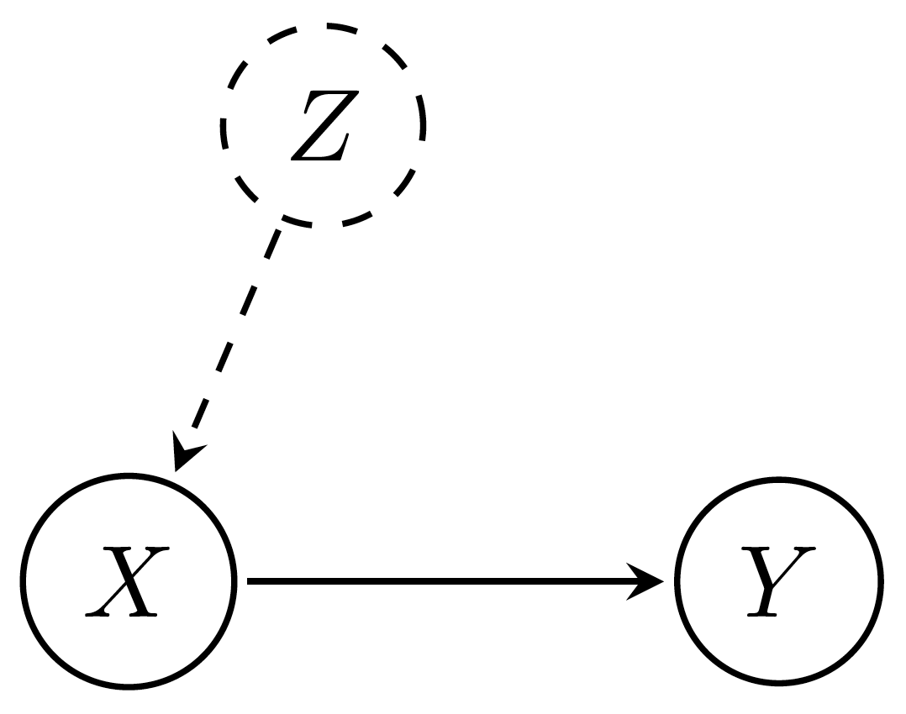
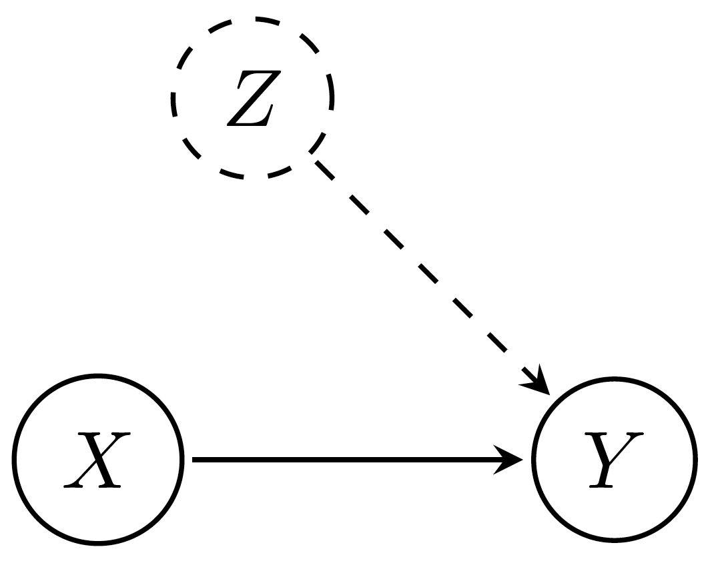

```{r setup}
# The first line sets an option for the final document that can be produced from
# the .Rmd file. Don't worry about it.
knitr::opts_chunk$set(echo = TRUE)

# The next bit (lines 50-69) is quite powerful and useful. 
# First you define which packages you need for your analysis and assign it to 
# the p_needed object. 
p_needed <-
  c("viridis", "knitr")

# Now you check which packages are already installed on your computer.
# The function installed.packages() returns a vector with all the installed 
# packages.
packages <- rownames(installed.packages())
# Then you check which of the packages you need are not installed on your 
# computer yet. Essentially you compare the vector p_needed with the vector
# packages. The result of this comparison is assigned to p_to_install.
p_to_install <- p_needed[!(p_needed %in% packages)]
# If at least one element is in p_to_install you then install those missing
# packages.
if (length(p_to_install) > 0) {
  install.packages(p_to_install)
}
# Now that all packages are installed on the computer, you can load them for
# this project. Additionally the expression returns whether the packages were
# successfully loaded.
sapply(p_needed, require, character.only = TRUE)
```

---

# Program for today

In this session, we have two things on our agenda:

1.  Implement OLS in Matrix Form in `R`.
    + Implement the OLS point estimator and OLS standard errors from the lecture in `R`.
    + Format the results nicely.
2.  Discuss the Gauss-Markov Theorem and see when it fails.

---


# The OLS Estimator in Matrix Form in `R`

## Point Estimates 

In the lecture we have derived the OLS estimator with the help of analytical optimization (see slides 4-7). For a linear model $y = X\beta + \epsilon$, we have shown that the OLS estimator is: 

$$
\hat{\beta} = (X'X)^{-1}X'y
$$


Let's do this with `R`. 

$X$ is our matrix of independent variables with an extra column of $1$s. 

**Why do we need the column of $1$s?**

We can generate some $X_{5 \times 3}$ to see it better:


```{r Generate fake X}
set.seed(20240221)

X <- matrix(c(rep(1, 5),
              rnorm(5, mean = 10, sd = 1),
              rnorm(5, mean = 50, sd = 2)),
            nrow = 5,
            ncol = 3)

X
```

To check whether our estimator works we want to generate $y$ from our $X$. **What are the dimensions of y?**

```{r Generate fake y}
# we define the true coefficients, aka parameters (beta) and add errors (epsilon).
beta0 <- 2
beta1 <- 1.5
beta2 <- 0.2
epsilon <- rnorm(5, 0, 0.01)

y <- beta0 * X[, 1] + beta1 * X[, 2] + beta2 * X[, 3] + epsilon

y
```


Now we work through the parts of the estimator bit by bit to understand what happens here exactly:

```{r Taking a look at the components of the OLS estimator}
X

# With t() we can transpose a matrix
t(X)

# With %*% we can multiply two matrices (if the "inner" dimensions are matching).
t(X) %*% X 

# solve() takes the inverse of a matrix (if it is invertible, aka nonsingular).
# solve(X) # will this work?
solve(t(X) %*% X)

# We already know %*% and t()
solve(t(X) %*% X) %*% t(X)

# And finally we add another %*% which should give us b_hat
solve(t(X) %*% X) %*% t(X) %*% y
```

Let's translate this into a single `R` function:

```{r OLS Point Estimator}
ols_point <- function(X, y) {
  
  b_hat <- solve(t(X) %*% X) %*% t(X) %*% y

  return(b_hat)
}
```


Let's check if our function gives us the same results:

```{r Applying the ols_point function}
ols_point(X, y)
```

Of course we usually want to apply it to some real data. So let's load the data set we work with today:

```{r, echo=FALSE, include=FALSE}
load("raw_data/uspres.RData")
```

Most of you know the data set already.

```{r}
data
```

We want to find out whether economic growth has an effect on presidential vote share controlling for the incumbent's party affiliation. Let the variable `democrat` indicate whether an incumbent is a Democrat. Then, the regression equation we would like to estimate is

$$
\text{vote}_i = \beta_0 + \beta_1 \times \text{growth}_i + \beta_2 \times \text{democrat}_i + \epsilon_i
$$

Let's use our function for the estimation:

```{r US Presidents and Economic Growth regression}
# Create a dummy variable that is 1 if the incumbent is Democrat

data$democrat <- as.numeric(data$party == "Democrat")

# Create matrix of independent variables and constant with an column of 1s

iv <- cbind(1, data$growth, data$democrat)

# The dependent variable is voteshare

dv <- data$vote

# Now we can use our function to calculate point estimates

ols_point(X = iv, y = dv)

# Check our results against the results of the  lm() function

m1 <- lm(vote ~ growth + democrat, data = data)

coef(m1)
```

Our estimates look good! But the output of our function doesn't look good yet. We will work on that later. But first we also need standard errors of the coefficients.

## Standard Errors

We derived the formula for the variance-covariance matrix of the OLS estimates in the lecture:

$$
Var(\hat \beta | X) = \underbrace{\sigma^{2}}_{\text{error variance}} (X'X)^{-1}
$$

Since we cannot observe $\sigma^2$, we need to estimate it first:

$$
\hat \sigma^{2} = \frac{e'e}{n - (k + 1)}
$$

where 

  - $e$ is a vector of our residuals ($e = y - X\hat\beta$), thus $e'e$ is the sum of squared residuals (RSS).
  - $n$ is the number of observations.
  - $k$ is the number of independent variables (excluding the constant).

With these formulas at hand, we are able to get the standard errors of the coefficients. 

So let's write an `R` function that calculates the OLS standard errors. To do so, the function should:

  + calculate OLS residuals
  + specify $n$ and $k$ and then use the residuals to calculate $\hat{\sigma}^2$
  + use $\hat{\sigma}^2$ to compute the variance-covariance matrix
  + take the square root of the diagonal of the variance-covariance matrix
  + return the standard errors

```{r OLS Standard Errors}
ols_se <- function(X, y) {
  
  # use the ols_point function to get estimates of beta
  b_hat <- ols_point(X, y)
  
  # Residuals
  e <- y - X %*% b_hat
  
  # Variance Estimates
  n <- nrow(X)
  k <- ncol(X)
  sigma_sq <- t(e) %*% e / (n - k) # constant is already in
  sigma_sq <- as.numeric(sigma_sq)
  
  # Variance Covariance matrix
  var_cov <- sigma_sq * solve(t(X) %*% X)
  
  # Standard Errors
  std_err <- sqrt(diag(var_cov))
  return(std_err)
}

ols_se(X = iv, y = dv)

# Check by comparing your results to the standard errors calculated by lm()
coef(summary(m1))[, 2]
```

Good job! But now we would need to call two functions to get the point estimates and standard errors. **Any ideas how we could combine both into one function?**

```{r Your own OLS function}
my_ols <- function(X, y) {
  
  # use the ols_point function to get estimates of beta
  b_hat <- ols_point(X, y)
  
  # use the ols_se function to get standard errors
  std_err <- ols_se(X, y)
  
  # store both in a matrix
  output <- cbind(b_hat, std_err)
  
  return(output)
}

my_ols(X = iv, y = dv)
```

## Formatting Output

Now we have all the information we want from a regression function. However, the output still doesn't look nice. We can improve that.

`print()` is a function that simply prints its arguments. These arguments can be pretty much anything. `cat()` also prints objects but it also allows to con`cat`enate the representations of multiple objects. A drawback is that it only works for atomic types (logical, integer, real, complex, character) and names. That means that you cannot `cat` a matrix or a list.

Here are some examples that demonstrate the `cat` and `print` function: 

```{r cat() print() to format output}
a <- "AQM"
b <- "is"
c <- "a lot of fun"
d <- diag(1, 3)

# print
print(a)
print(c(a, b, c))
print(d)

# cat
cat(a)
cat(a, b, c, "\n")
cat(d)
```

The following function is an example of how one can use and combine `cat` and `print` to generate some nice looking output. It takes an object `obj` which in our case is a matrix of coefficients and their standard errors, arranges it in a convenient away and provides some additional information. Then, we can add the `form_out` function to our master OLS function. There are many possibilities for extensions. If you like, play around with it and write your own formatting function at home. (To give you some ideas... You could include t-values, p-values and even stars...)

One more thing: so far you have primarily written functions that require all arguments to be specified. But this does not always have to be the case. Say, we want to add an option to round the output in the printout (importantly, still preserving the unrounded numbers in the output object). You don't always need to do this, but you want to have the option, if you want. We will thus add the argument `digit` into our formatting function. Inside the body, we will check if that argument was specified with `missing()` function and if it was not, no changes to raw number will be made. 

```{r Formatting output and integrating it in our my_ols function}
form_out <- function(obj, k, n, digit) {
  # Do we have specified variable names?
  if (is.null(rownames(obj))) {
    var_names <- c("Intercept", paste("Var", 1:(k - 1)))
    rownames(obj) <- var_names
  }
  
  # Assign column names
  colnames(obj) <- c("Estimate", "Std. Error")
  
  # List of output values: estimates, number of obs, degrees of freedom
  out <- list(obj, n, n - k)
  
  # Headline
  cat("\nRegression Results\n", rep("=", 40), "\n", sep = "")
  
  # Main table
  # if "digit" argument was not specified (i.e. missing) print raw 
  if (missing(digit)) {
    print(out[[1]])
  } else{
    print(round(out[[1]], digit))
  }
  
  # Additional info
  cat("\n",
      "Observations: ",
      out[[2]],
      "\n",
      "Degrees of Freedom: ",
      out[[3]],
      "\n",
      sep = "")
}

# Integrate the form_out function into my_ols
my_ols2 <- function(X, y, digit) {
  
  # use the ols_point function to get estimates of beta
  b_hat <- ols_point(X, y)
  
  # use the ols_se function to get standard errors
  std_err <- ols_se(X, y)
  
  output <- cbind(b_hat, std_err)
  colnames(output) <- c("coef", "se")
  
  k <- ncol(X)
  n <- nrow(X)
  
  cat(form_out(output, k, n, digit = digit))
  return(output)
}

res <- my_ols2(X = iv, y = dv)
```

That looks quite nice. And we did it by ourselves!

# The Gauss-Markov Assumptions

In the lecture we have discussed the Gauss-Markov Theorem and its corresponding assumptions. The theorem states that the OLS estimator is the **B**est **L**inear **U**nbiased **E**stimator (**BLUE**) if four assumptions are satisfied. These are: 

1.  Linearity in parameters: $y = X\beta + \epsilon$
2.  No perfect collinearity in covariates: $X$ has full column rank
3.  Zero conditional mean of errors: $E[\epsilon | X] = 0$
4.  Homoskedasticity and uncorrelated errors: $Var(\epsilon | X) = E[\epsilon \epsilon' | X] = \sigma^2 I_n$

$$
\begin{aligned}
E[\hat{\beta}_{OLS}|X] 	& = E[(X'X)^{-1}X'y|X]                     & \text{(2) } (X'X)^{-1}\text{exists}   \\
                        & = E[(X'X)^{-1}X'(X\beta + \epsilon)|X]   & \text{(1) Linearity}             \\
                        & = E[\underbrace{(X'X)^{-1}X'X}_{I}\beta + (X'X)^{-1}X'\epsilon)|X]           \\
			                  & = E[\beta + (X'X)^{-1}X'\epsilon|X]                                          \\
			                  & = \beta  + \underbrace{E[(X'X)^{-1}X'|X]}_{(X'X)^{-1}X'}\underbrace{E[\epsilon|X]}_{0} & \text{(3) Zero conditional mean}  \\
			                  &= \beta.
\end{aligned}
$$

### Linearity in Parameters

Assumption (1) essentially defines the multiple linear regression model. We can see above that when it fails, we cannot substitute $y$ with $X\beta + \epsilon$ but have to substitute with something else.

### Full Rank 

Assumption (2) ensures that we can find the OLS estimator by taking the inverse of the square (symmetric) matrix $X'X$. If $X$ has not full column rank, it means there is perfect multicollinearity, i.e. there is linear dependence. Hence, we cannot take the inverse and therefore cannot compute the OLS estimator.

Here is an example where assumption (2) is violated: 

```{r, eval=FALSE}
set.seed(1234)
x1 <- rnorm(5, 10)
X <- matrix(c(rep(1, 5), 
              x1, 
              2 * x1), 
            nrow = 5)

y <- 2 * X[, 1] + 0.3 * X[, 2] + 0.4 * X[, 3] + rnorm(5, 0, 0.001)

# What would happen if we tried to run our ols function?
my_ols2(X, y)
```

`X[, 3]` is a linear transformation of `X[, 2]`, thus the two data columns are perfectly collinear and we cannot compute the inverse of $X'X$. 

Full rank also implies that in matrix $X$ with $m$ columns, $n \geq m$, i.e. we have more rows than independent variables. So this assumption (2) is also sometimes called an identification assumption. It ensures that the vector of coefficients $\beta$ is unambiguous.

## Zero Conditional Mean

Assumption (3) is probably the most important assumption and the one that is definitively the most tricky. Practically, this means that $X$ does not help us in predicting the values of error terms, or, in other words, the data generating process of $X$ is independent of the data generating process of the error terms. If an explanatory variable is uncorrelated with the error term, one often says that the explanatory variable is *exogenous*. Let's spend some time to look at cases when it might fail. 

Here is an example where the zero conditinoal mean assumption is violated:

```{r, echo=FALSE}
set.seed(1234)
# first independent variable and intercept
n <- 100
X <- cbind(rep(1, n),
           runif(n))
# second independent variable
X <- cbind(X, 
           rbinom(n, size = 1, 
                  prob = ifelse(X[, 2] > 0.5, 0.98, 0.02)))

# true betas
beta <- c(0, 0.5, 5)

# dependent variabl
y <- X %*% beta + rnorm(n, 0, 0.5)

# plot bivariate regression (y ~ X[,2])
par(mfrow = c(1,2))
plot(x = X[,2],
     y = y,
     pch = 19,
     col = viridis(1),
     main = "Bivariate regression\nwith omitted confounder",
     xlab = "x",
     las = 1)

abline(lm(y ~ X[,2]))

# residual plot
plot(x = X[,2],
     y = residuals(lm(y ~ X[,2])),
     pch = 19,
     col = viridis(1),
     main = "Residual plot:\nZero conditional mean violation",
     ylab = "Residuals",
     xlab = "x",
     las = 1)
abline(h = 0)
loess <- loess(residuals(lm(y ~ X[,2])) ~ X[,2])
lines(x = loess$x[order(loess$x)],
      y = loess$fitted[order(loess$x)],
      col = viridis(2)[2],
      lwd = 2)
```


Remember DAGs? The assumption is violated if we fail to account for confounder. Imagine the following situation:



$$
  y = X\beta_1 + Z\gamma + \epsilon
$$

where $X$ and $Z$ are two sets of independent variables. Let's say that we have data for $X$ but we cannot observe  the variables in $Z$ and therefore we cannot include it into the regression. Then, our estimator is

$$
	\hat{\beta_1} = (X'X)^{-1}X'y.
$$

Can $\hat{\beta}$ be unbiased and, if not, is there anything we can say about the bias? We re-do the proof from earlier:

$$
\begin{aligned}
	E[\hat{\beta_1}|X] 	&= E[(X'X)^{-1}X'y | X, Z] \\
			&= E[(X'X)^{-1}X'(X\beta + Z\gamma + \epsilon) | X, Z] \\
			&= E[(X'X)^{-1}X'X\beta + (X'X)^{-1}X'Z\gamma + (X'X)^{-1}X'\epsilon | X, Z] \\
			&= E[\beta + (X'X)^{-1}X'Z\gamma + (X'X)^{-1}X'\epsilon | X, Z] \\
			&= \beta + (X'X)^{-1}X'Z\gamma  \\
			&= \beta + \delta\gamma. 
\end{aligned}
$$

where 

$$
\delta = (X'X)^{-1}X'Z
$$

Note that this is the regression coefficient we would get if we would regress $Z$ on $X$.
 
The equation above is a well known result called omitted variable formula. The amount of bias is expressed by $\delta\gamma$. Inspecting it, we can conclude that our estimate of $\beta_1$ will be biased except if

1.  there is no effect of the omitted variable on the outcome, i.e. $\gamma = 0$.
2.  $X$ and $Z$ are uncorrelated and thus $\delta = 0$.

To build an intuition behind that, imagine that $X$ and $Z$ refer to a single variable respectively. The intuition for the first case is simple: if $\gamma = 0$ then the variable $Z$ is irrelevant. That means that the OLS estimator will be unbiased even if we misspecify the regression equation by including irrelevant variables. This would be a corresponding DAG:



The second part, $\delta$, refers to the association between $X$ and $Z$. If these variables are orthogonal (i.e. uncorrelated), then omitting $Z$ does not cause OVB. This can be visualized with a DAG as well:




## Exercise: Calculating the Omitted Variable Bias

Write a function calculating the bias of $\hat{\beta}$ given two variables $X$ and $Z$ and a true value for $\gamma$. Create some fake data and calculate the amount of the bias. By varying the size of $\gamma$ and the correlation between the two variables determine the direction of the bias for the following scenarios:

  Scenarios   | $Corr(x ,z) > 0$      | $Corr(x,z) < 0$
 :---         | ---                   | ---
$\gamma > 0$  |                       |
$\gamma < 0$  |                       |

```{r Exercise: Calculating the Omitted Variable Bias, eval = F}
# Translate the expression for the bias from above into a R function.

ovb <- function(x, z, gamma) {
  delta <- solve(t(x) %*% x) %*% t(x) %*% z
  bias <- delta * gamma
  return(bias)
}

# Generate some data (X) to inspect the four scenarios.
x <- rnorm(500)
e <- rnorm(500, 0, 0.5) # vary the variance to induce correlation

# set a value for delta and simulate data (relation of confounder z with x)
delta <- 1
z <- delta*x + e

# check correlation
cor(x, z)

# set a value for gamma (relation of confounder z with y)
gamma <- 1 # vary coefficient size

# apply the function
ovb(x, z, gamma)
```

## Uncorrelated Errors

Assumption (4) does not appear directly when we show that $\beta_{OLS}$ is BLUE. Yet it is a critical one. 

$$
Var(\epsilon | X) = \sigma^2 I_n = 
\begin{pmatrix}
      \sigma^2 & 0 & \cdots & 0 \\
      0 & \sigma^2 & \cdots & 0 \\
      \vdots & \vdots & \ddots & \vdots \\
      0 & 0 & \cdots & \sigma^2 \\
\end{pmatrix}
$$ 


In short, the diagonality of this matrix corresponds to the assumption of uncorrelated errors, while the constancy of the diagonal elements corresponds to the assumption of constant variance or homoscedasticity. 

---

# Concluding Remarks

Next time we will talk about the homoskedasticity part of assumption (4), and we will implement one of the remedies for it - the robust standard errors - and discuss this concept in a bit more detail. 

